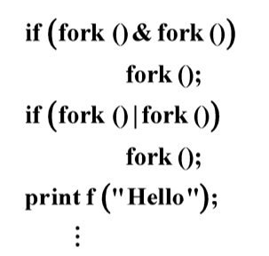

# جلسه 2 سیستم عامل

## دستور کار
1.	آشنایی با دایرکتوری proc/ و توضیح درباره فایل‌های version- cpuinfo- meminfo
2.	توضیح درباره فرآیند با pid 1 با دستور man و توضیح درباره فایل های- sched- status آن فرآیند
3.⭐	یکی از فرآیندهای دایرکتوری proc/ را به دلخواه انتخاب و درباره فایل‌های داخل دایرکتوری انتخاب شده به اختصار بنویسید.
4.	برنامه ای بنویسید که pid فرآیند را با استفاده از تابع ()getpid بدست آورد آن فرآیند را با دستور ps aux مشاهده کنید و با دستور kill آن را بکشید.
5.	به برنامه تسک 4 تابعی اضافه کنید که  pidپدر فرآیند ایجاد شده را نشان دهد با pstree آن فرآیند را مشاهده کنید و درباره پدر آن مختصر توضیح دهید.
6.	با فراخوان سیستمی ()fork یک فرزند ایجاد کنید.
7.	جدا بودن حافظه پدر و فرزند را نشان دهید.
8.	برنامه فرآیند زامبی و یتیم را بنویسید و آن ها را با دستورات مربوطه مشاهده کنید.
9.	برنامه ای بنویسید که از دو ()fork استفاده کند (دو فرآیند فرزند ایجاد کنید) با pstree مشاهده کنید
10. درباره دستورات  execv, execl, execvp, execlp کارکرد و تفاوت آن ها توضیح دهید.

تمرین امتیازی: تکه برنامه زیر چند بار Hello را چاپ می‌کند؟

